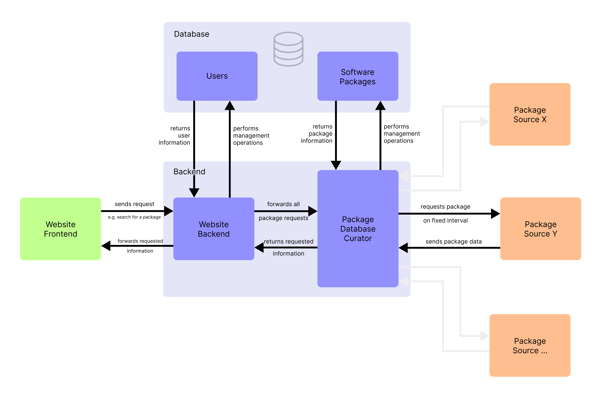
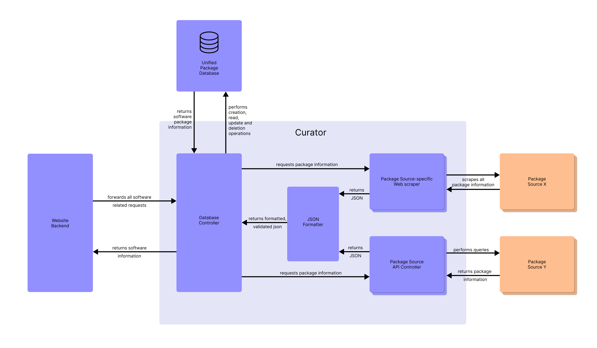

# Jeweler - A web-based tool to simplify package installations on Linux

Getting started with Linux can be really difficult for people without a technical background. Since different distributions of Linux can have varying ways to install new software and most require the knowledge of using the terminal, beginners can easily be deterred from considering Linux as their operating system.

Jeweler aims to make this process more straightforward for beginners by determining a user's Linux distribution to provide only compatible software sources. Users can search for software they wish to install and Jeweler serves every compatible source with detailed information about the steps necessary for installation.

## Table of Contents

- [Running this project locally](#running-this-project-locally)
- [Documentation](#documentation)
- [Routes](#routes)
- [Version Control](#version-control)

## Running this project locally

To run this project locally follow these steps:

1. Clone this repository
2. Use the `compose.yaml` to start the local postgres database in a docker container
3. Create a .env file following the scheme of the .env.example

```sh
# Backend port
PORT=ADD_BACKEND_PORT_HERE

# Node environment
NODE_ENV=development

# Postgres database URL
DATABASE_URL=ADD_DATABASE_URL_HERE

# JWT secret
JWT_SECRET=ADD_JWT_SECRET_HERE

# database sync interval in minutes (default: 1440 = 24 hours)
# not yet used 
SYNC_INTERVAL=1440 
```

4. run `npm install` to install dependencies
5. run `npm run dev` to start the express server

## Documentation

This project has been deployed on Heroku



### Curator

The main component controlling the software packages in the database is the curator component.
All requests regarding packages should always go through the curator since it contains the logic to request info from external sources, should the jeweler database not contain the requested information.



### Database

For this project PostgreSQL was used to create a relational database with Prisma as the ORM. Currently the decision to migrate to a NoSQL database is being weighed.


This diagram is missing the many-to-many relation tables for

- LinuxDistroToPackageSource  -  Used to store information about the Linux Distros supported by every Software Source
- LinuxDistroToUser  -  Used to store Linux Distros a user is using
- SoftwareToUser  -  Used to store software bookmarked by a user

## Routes

The following routes have been implemented

### GET

- `/` - index route
  
- `/software/info/:name` - Fetches single package from database and if not in database fetches it from external sources

- `/softwarea/all` - Returns all software packages currently in the database
  
- `/software/allsources` - Returns all software packages currently in the database with the source the entry originated from

- `/search/:query` - Performs fuzzy search to find loosely matching packages

- `/search` - Returns info that no query was provided

- `/info/aur/:name` - Fetches info on software package from Arch AUR, skipping the jeweler database

- `/user/:id` - Returns info of currently logged in user (Authentication needed) 

### POST

- `/aur/sync` - Forces database sync between jeweler database and AUR database

- `/register` - Performs account creation after validating signup information

- `/login` - Performs login and returns JWT Token

## Version Control

### Branching

The projects repository consists of three branches

- `Development` - The main branch to commit new changes to. When this branch reaches a significant milestone, Development merges with Staging

- `Staging` - This branch is used to test major changes before deploying them to Production. Staging is also in a separate deployed environment closely reassembling the production environment

- `Production` - Changes are pushed to Production after undergoing testing in the Staging environment

If the project were to increase in scale I would switch to different environments instead of branches and create feature branches that are merged into the main development branch once ready.

### Commits

Commits are checked using a linter and only ever pushed to Development. Once testing is correctly implemented, tests will also be run before a push can be made. The size of commits correlates to the feature being implemented and always done once progress is made.  Code containing errors of any kind including linting errors is never committed.

### Merging

Since merging only happened from Development to Staging and from Staging to Production there were never any conflicts while merging.

### Issues faced

A major issues for me was frequently committing. As stated before, the size of them always depended on the size of what I was currently working on and the frequency always depended on a milestone being reached. This is something that I have to improve on.